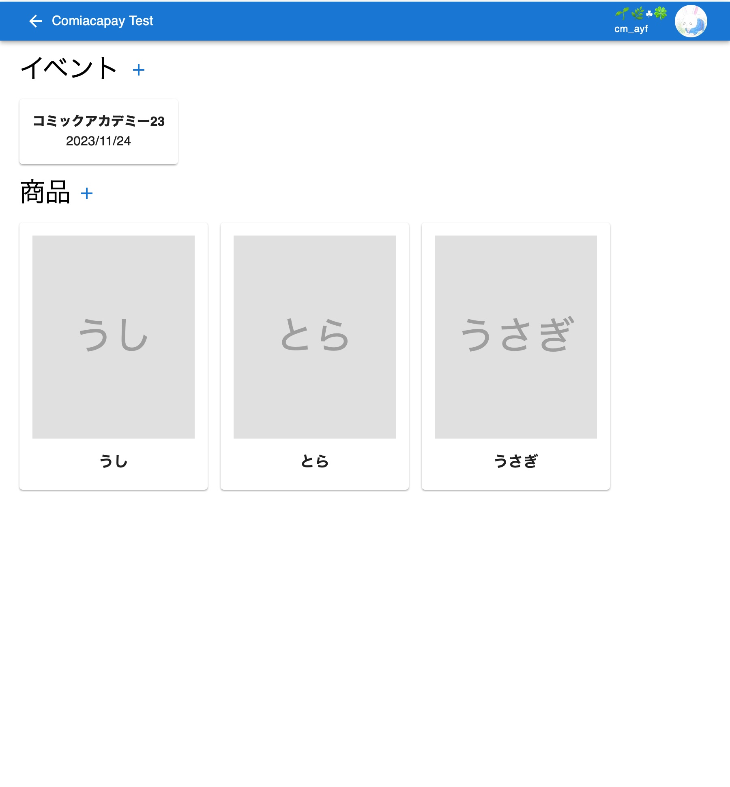
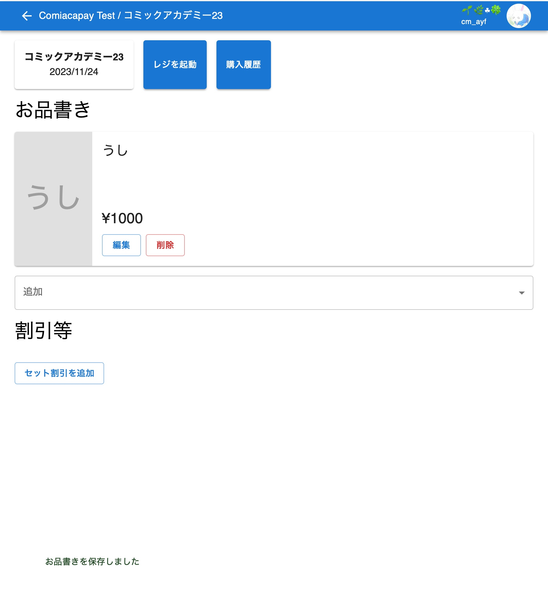
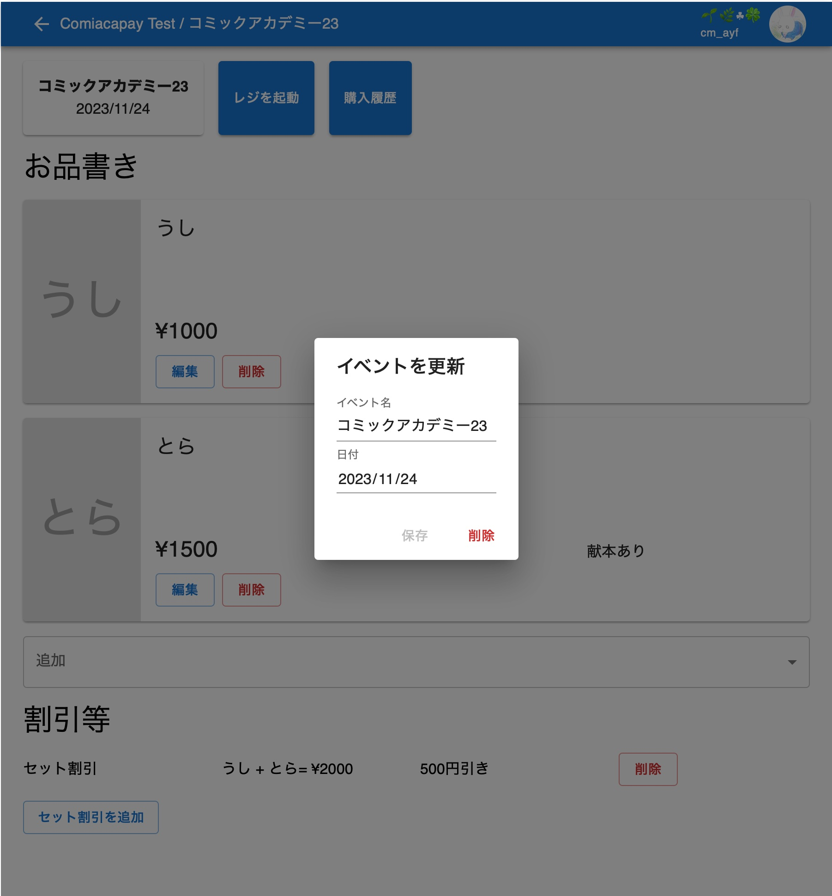
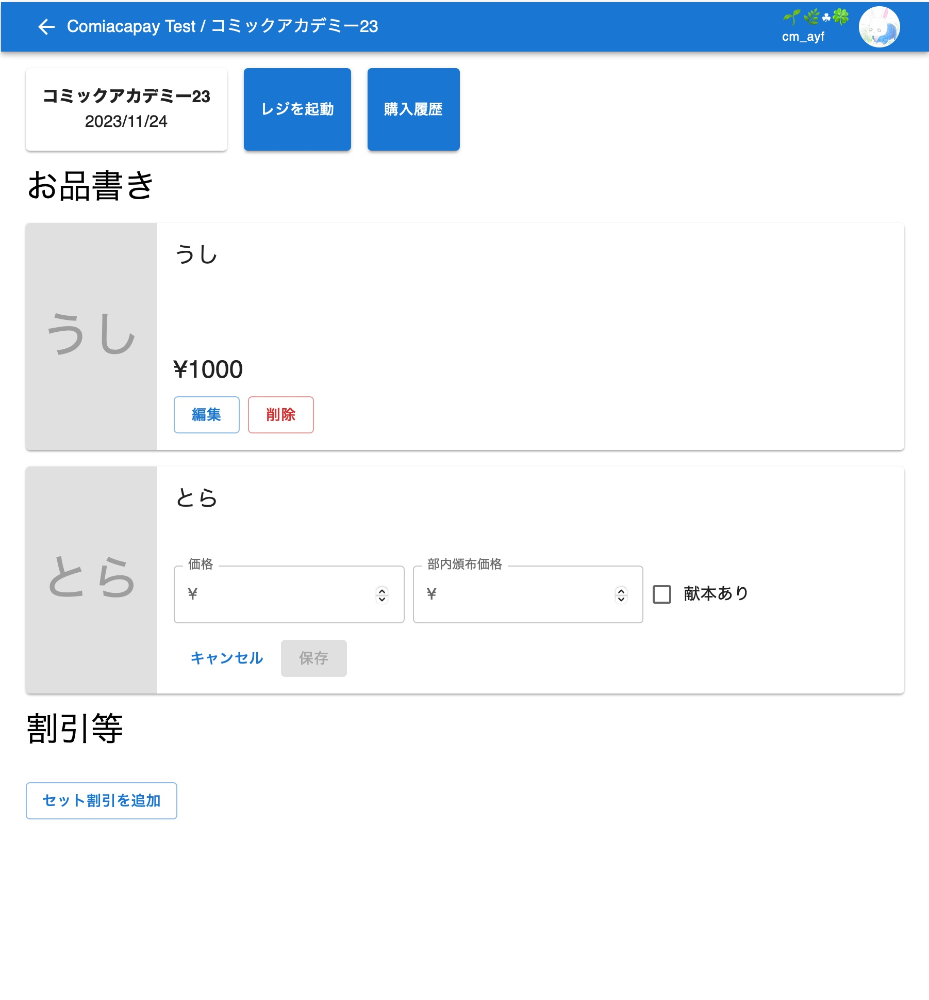
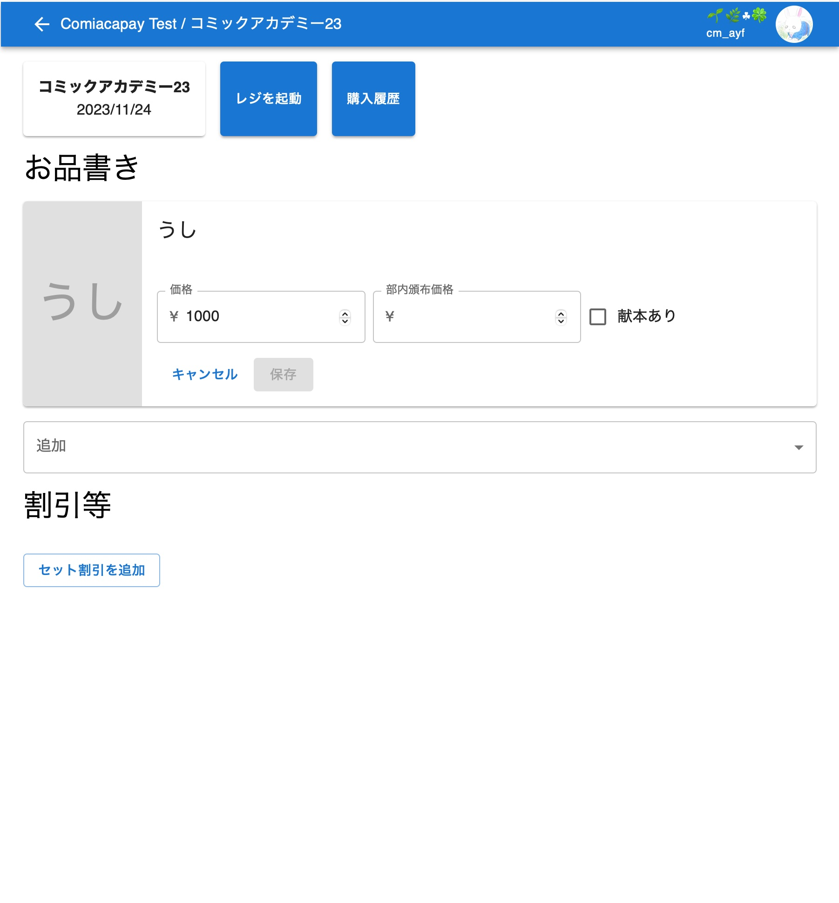
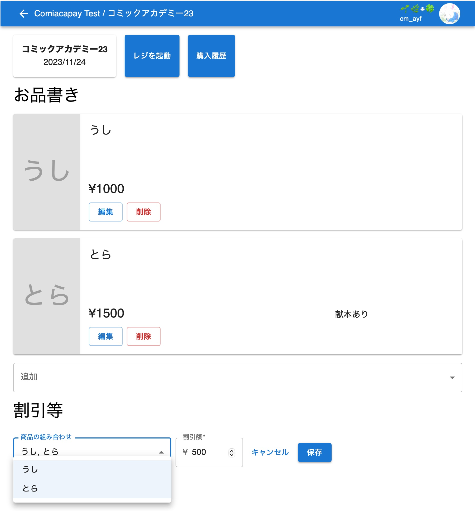

#　イベントの設定

[戻る](index.md)

実際のイベントで使用するレジ画面を設定します．

設定できる項目は以下の4つです：
- イベント名（必須）
  - 表示される名前を指定します
- 日付
  - 表示されます
  - 左上にサーバー名が表示されている画面でのイベントが並ぶ際，この日付が新しい順で並びます
- お品書き
  - そのイベントのお品書きを設定します
  - どの商品をいくらで売るのかを設定します
  - 部内頒布価格を設定したり，献本（売上に計上しないが，在庫を減らす）を可能にするか設定できます
- 割引等
  - 部内頒布価格と献本以外の割引を設定します
  - 現在，「セット割引」のみに対応しています

イベントの追加は，左上にサーバー名が表示された画面で行います．[サインイン](signin.md)して，トップ画面でサーバーを選んでください．

また，イベントの設定は，左上にサーバー名とイベント名が表示された画面で行います．左上にサーバー名が表示された画面で，イベントを選んでください．

## イベントの追加

1.  「イベント」の右の「+」ボタンを押します．
1.  必要な項目を埋めて，「保存」を押します．
    
1.  成功したら，左上にサーバー名とイベント名が表示された画面に遷移します．

## 「イベント名」と「日付」の編集

1.  イベント名と日付が書かれたカードを押します．
1.  設定を変更して，「保存」を押します．
    

## お品書きの追加

1.  「お品書き」の一番下，「割引等」の上の「追加」から，商品を選択します．
1.  必要な項目を埋めて，「保存」を押します．
    - 「価格」は必須です
    - 「部内頒布価格」を設定すると，レジ画面で「部内」を選べるようになり，選ぶとその価格で売上が計上されます
    - 「献本あり」にチェックを入れると，レジ画面で「献本」を選べるようになり，選ぶと売上は計上されませんが，在庫は減ります
    

## お品書きの編集

1.  お品書きのカードにある「編集」ボタンを押します．
1.  設定を変更して，「保存」を押します．
    - 各項目については[お品書きの追加](#お品書きの追加)を参照してください
    

## お品書きの削除

1.  お品書きのカードにある「削除」ボタンを押します．

- すでに売上が登録されているお品書きは削除できません．

## セット割引の追加

1.  「割引等」の一番下にある「セット割引を追加」ボタンを押します．
1.  必要な項目を埋めて，「保存」を押します．
    - 「商品の組み合わせ」にある商品を全て購入した場合に割引が適用されます．
    - 「割引額」が「商品の組み合わせ」の合計金額から差し引かれます．
    

## 割引等の削除

1.  割引等の列の右端にある「削除」ボタンを押します．
