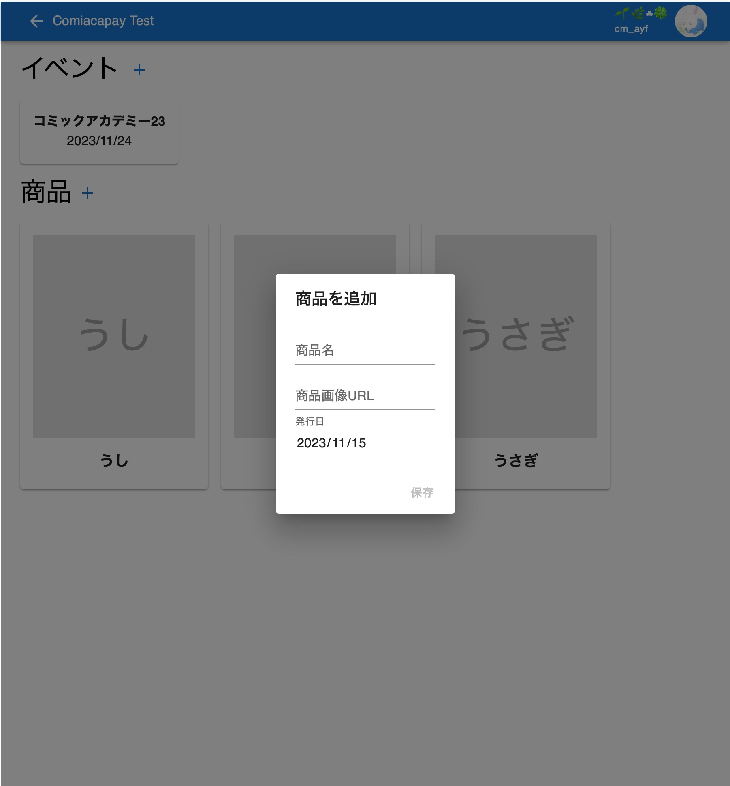
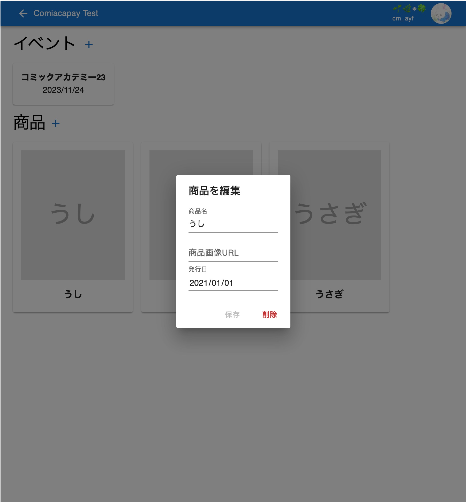

# 商品の設定

[戻る](index.md)

レジやお品書き等で表示される商品の設定を行います。

設定できる項目は以下の3つです：
- 商品名（必須）
  - 表示される名前を指定します
- 商品画像URL（任意）
  - 表示される画像を指定します
  - 設定する場合，画像がWebサイトやTwitterなどに上がっている必要があります
    - 「画像のアドレスをコピーする」などで得られるURLを指定します
  - 設定しない場合，商品名が書かれたダミー画像が表示されます
- 発行日（必須）
  - 表示されません
  - お品書きなどで商品が並ぶ際，発行日が新しい順で並びます

商品の設定は，左上にサーバー名が表示された画面で行います．[サインイン](signin.md)して，トップ画面でサーバーを選んでください．

また，以下の手順でボタンが押せない場合は，WRITE権限がありません．管理者に[権限について](permissions.md)を確認してもらってください．

## 商品の追加

1.  「商品」の右の「+」ボタンを押します．
1.  必要な項目を埋めて，「保存」を押します．
    

## 商品の編集

1.  商品のカードを押します．
1.  設定を変更して，「保存」を押します．
    

## 商品の削除

1.  商品のカードを押します．
1.  「削除」を押します．

- すでにいずれかのイベントのお品書きに登録されている商品は削除できません．
