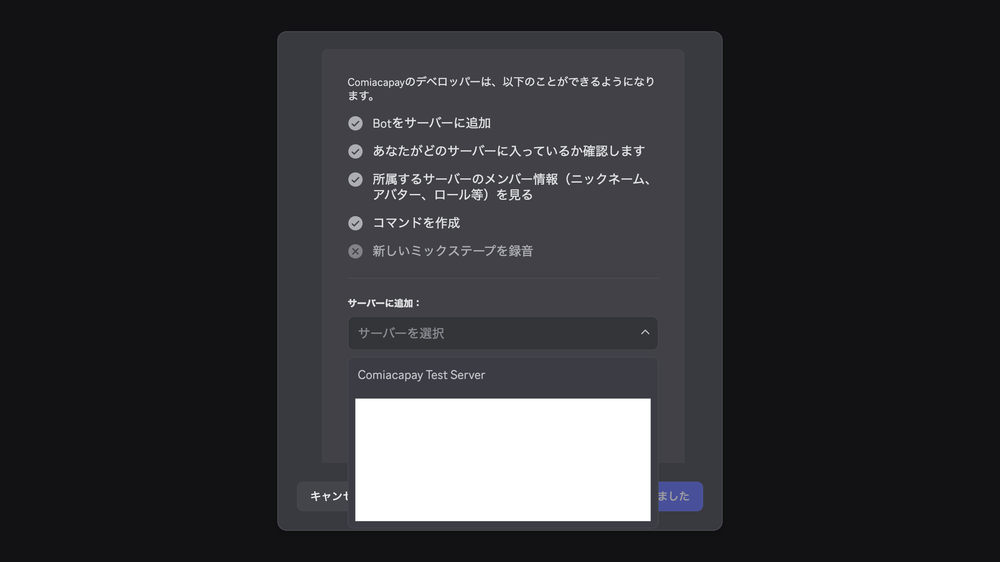

# 権限について

[戻る](index.md)

Comiacapayは，Discordサーバーを使って権限を管理します．
イベントや商品の**設定はDiscordサーバーと紐づいており，そのサーバーにおける権限を持った人だけが閲覧・設定できます**．

例えば，DiscordサーバーA~Cがあり，あなたはAで管理者であり，Bで閲覧権限を持っており，Cには参加しているが閲覧権限がなく，Dには参加していないとします．
このとき，

- 管理者であるAではイベントや商品の設定ができ，またAに関する権限設定ができます
- 閲覧権限があるBではイベントや商品の設定を閲覧することができます
- 参加だけしているCについては Comiacapay を利用していることはわかりますが，それ以外は何もわかりませんし何もできません

というように，Discordサーバーにおける権限によってComiacapayの権限が決まります．ただし，管理者であっても，編集権限がついていない限り編集を行うことはできません．

それぞれの権限をサーバー内のメンバーに与えるには，**対応するDiscord上のロールをそのメンバーに付与します**．

## 権限の種類

Comiacapayには，以下の4種類の権限があります：

- READ（閲覧）：そのサーバーに紐づいた全ての商品・イベント・購入履歴を閲覧できます
- REGISTER（レジ）：そのサーバーに紐づいたイベントの購入履歴を登録できます
- WRITE（編集）：そのサーバーに紐づいた全ての商品・イベントを作成・変更できます
- ADMIN（管理）：どのロールを持っている人に以上3つの権限を付与するか設定できます

このうちADMIN以外の3つの権限はDiscord上のロールに対応し，そのロールが付与されているメンバーに与えられます．

ADMIN権限はDiscord上で管理者権限を持っているか（Botを導入できるか）に対応します．

## 権限の設定

新しくサーバーを登録したり，権限を設定するには，以下の手順を行います：

1.  Discord上で，権限に対応するロールを作成します．
1.  [サインイン](signin.md)します．
1.  トップ画面で「追加・設定変更」ボタンを押します．
    
1.  DiscordでBotを追加する画面が表示されるので，追加・設定したいサーバーを選択して「認証」ボタンを押します．このとき表示されるサーバーは自分が管理者であるサーバーだけです．
    
1.  Comiacapayの画面に戻るので，サーバーの権限を設定します．
    
    - READ・REGISTER・WRITE権限を設定できます．
    - `@everyone`を選択し，そのサーバーの全てのメンバーに権限を与えることもできます．

権限の設定を変更する際は，最初の設定と同じ手順でも可能ですが，サーバーの画面でサーバー名が書かれたカードをクリックしても設定を開始できます．この場合，DiscordでBotを追加する画面でサーバーを選択する必要はありません．

