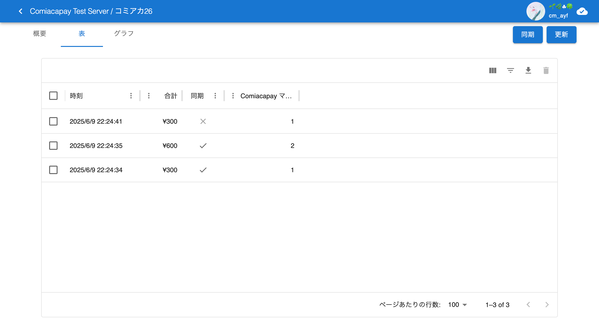
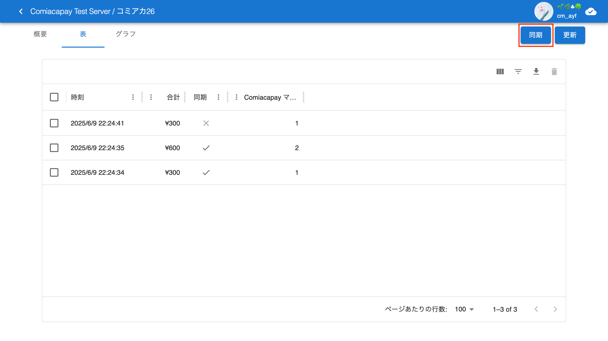

# 購入履歴画面

[戻る](index.md)

購入履歴画面では，そのイベントでの売り上げなどの概要と，全ての購入履歴の一覧を見ることができます．購入履歴は CSV ファイルとしてエクスポートできます．

また，端末上にしかない購入履歴をクラウドに同期することや，誤って登録された購入を削除することもできます．

購入履歴画面を開くにはは，左上にサーバー名とイベント名が表示された画面で，「購入履歴」ボタンを押します．

購入履歴画面には，3つのタブと2つのボタンがあります．

## 「概要」タブ

「概要」タブでは，そのイベントでの売上額とそれぞれの商品ごとの売上数を見ることができます．

## 「表」タブ

「表」タブでは，1 つの購入を 1 行として，全ての購入履歴を見ることができます．この購入履歴には同期されていないものも含まれます．購入の削除もここで行います．

表の上部の見出しを操作することで，購入時刻や合計数でソートしたり，フィルターしたりすることができます．

表の「同期」行には，その購入がクラウドに同期されているかどうかが表示されます．`true`となっていれば同期されています．

この表では，以下の2つの操作を行うことができます：

- CSVエクスポート：表の右上にある右から2つ目のボタンを押すと，表の内容をCSVにエクスポートできます．
- 購入履歴の削除：表の左にあるチェックボックスで列を選択し，右上にある一番右のボタンを押すと，選択した購入履歴を削除できます．

## 「グラフ」タブ

「グラフ」タブでは，そのイベントでの売上額とそれぞれの商品ごとの売上数の遷移を観察できます．

- 「売上を表示」のトグルスイッチで売上を表す線をを表示・非表示できます．
- 「商品を表示」の複数選択ボックスで商品ごとの売上数を表す線と塗りつぶしを表示・非表示できます．

## 「同期」ボタン

端末上にしかない購入履歴をクラウドに同期します．  
ボタンが青い時は，端末上に同期すべき購入履歴が残っています．同期ボタンを押して同期が完了し，ボタンが押せなくなる（灰色になる）ことを確認しましょう．

## 「更新」ボタン

表示されている購入履歴の情報を最新にします．
