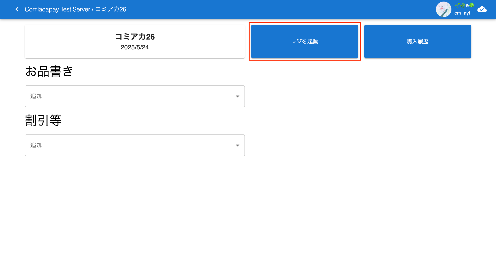
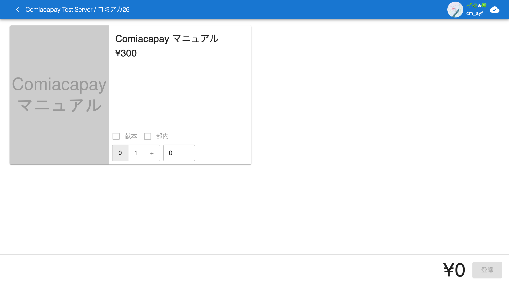

# レジ画面

[戻る](index.md)

レジ画面では，1 回の購入をまとめて登録し，複数の購入をクラウド上に「同期」します．

レジ画面を開くにはは，左上にサーバー名とイベント名が表示された画面で，「レジを起動」ボタンを押します．

## 画面構成

上部には，左側に戻るボタンとイベント名，右上にサインインしている Discord ユーザー名とアイコンが表示されます．

下部には，右下に支払額と「登録」ボタンが表示されます．

中央には，レジの打ち込み画面が表示されます．

### 打ち込み画面

打ち込み画面には，商品ごとのカードが複数並んでいます．

1 つのカードには，商品の名前と画像が書かれていて，購入数を指定できるようになっています．

購入数を指定する方法は 2 つあります．

- ボタン：「0」「1」「+」の 3 つです．「0」「1」を押すとその数になり，「+」を押すと 2 から始まって押すたびに 1 ずつ増えます．
- 入力欄：数字を直接入力できます．

また，「献本」ボタンがあります．イベントに設定されている計算機の設定により，ここにチェックを入れて値段を変更することができます．

## 一連の流れ

まず，レジ画面にアクセスします．

以下が 1 回の購入の流れです：

1. 商品の購入数を指定する．
   - 複数の商品を購入する場合，全て指定します．
1. 表示された支払額を支払ってもらう．
1. 「登録」ボタンを押す．

## オフラインでの機能

トップ画面の「最近のイベント」から開いた場合など，特定の条件を満たしていると，オフラインでもレジ画面が使えます．右上の雲のマークで接続状態がわかります．

オフラインで「登録」ボタンを押すと，端末上には購入履歴が記録されますが，クラウドには同期されません．[購入履歴画面で「同期」](receipts.md#同期ボタン)することで，端末の記録をクラウドに同期することができます．
